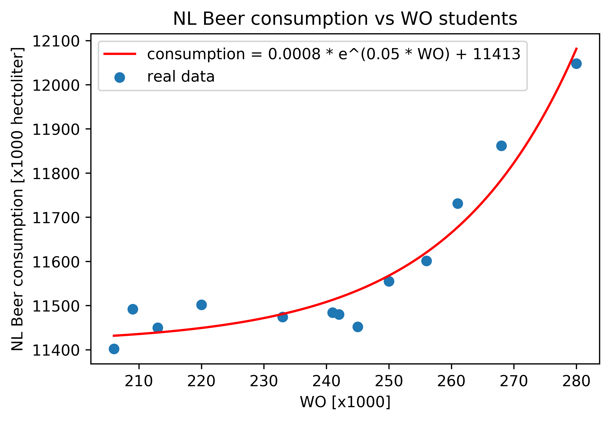

##Titles of papers

- MCC Van Dyke et al., 2019 could refer to either of the following two papers:
    - The Rise of Coccidioides: Forces Against the Dust Devil Unleashed
    - Fantastic yeasts and where to find them: the hidden diversity of dimorphic fungal pathogens

- JT Harvey, Applied Ergonomics, 2002 refers to:
    - An analysis of the forces required to drag sheep over various surfaces

- DW Ziegler et al., 2005 refers to:
    - The neurocognitive effects of alcohol on adolescents and college students

##Plot

I found a correlation curve that would fit the data reasonably well, using the scipy.optimize curve_fit function.
Values are rounded to the first non-zero decimal.